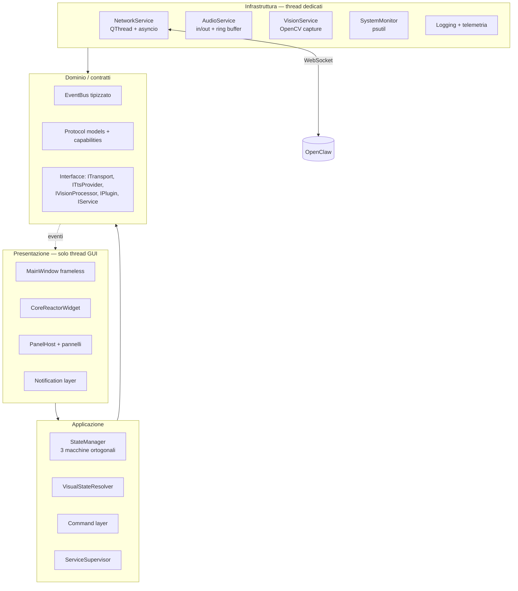

# J.A.R.V.I.S. Desktop Interface — Analisi architetturale e proposta

> **Stato: PROPOSTA — in attesa di approvazione.**
> Nessun codice applicativo è stato ancora generato. Questo documento è la
> revisione critica dell'architettura richiesta nel brief, con le modifiche che
> raccomando e la motivazione di ciascuna. Dopo l'approvazione si procede per
> fasi (vedi §13).

---

## 1. Verdetto sull'architettura proposta

L'impostazione del brief è **corretta nella sostanza**: separazione netta fra
cervello (OpenClaw) e interfaccia, event bus interno, state manager, moduli
disaccoppiati, nessun blocco del main thread. Non ho obiezioni sui principi.

Ho invece **11 punti di divergenza tecnica** e **9 moduli mancanti** che, se non
affrontati ora, si pagano fra due anni sotto forma di riscrittura — che è
esattamente ciò che il brief vuole evitare. Li elenco in ordine di impatto.

Riassunto delle divergenze principali:

| # | Punto del brief | Raccomandazione | Impatto se ignorato |
|---|---|---|---|
| 2.1 | PyQt6 preferito | **PySide6** dietro shim `qtcompat` | Vincolo di licenza GPL sulla distribuzione |
| 2.2 | Animazioni con `QPropertyAnimation` | QPropertyAnimation **come driver di parametri** + render `QPainter` su clock unico | 8 timer concorrenti, frame irregolari, CPU alta |
| 2.3 | Stati globali in un unico enum | **Tre macchine a stati ortogonali** + `ERROR` come flag, non stato | Perdita di contesto sugli errori, transizioni ambigue |
| 2.4 | ElevenLabs nella GUI | TTS **lato backend** per default, locale opzionale | Chiave API e decisione di prodotto dentro la GUI |
| 2.5 | Event bus con eventi stringa | Eventi **tipizzati** + marshalling thread-safe | Typo silenziosi, race condition cross-thread |
| 2.6 | `logs/` dentro il progetto | Log e config in **directory utente OS** | Log persi ad ogni aggiornamento, permessi negati |
| 2.7 | asyncio implicito | Loop asyncio **confinato in un QThread dedicato** | Fragilità di `qasync`, freeze della GUI |
| 2.8 | — | **MockBackend** obbligatorio | Impossibile sviluppare/testare senza OpenClaw acceso |
| 2.9 | — | **Contratto di protocollo versionato** + adapter | Ogni modifica a OpenClaw rompe la GUI |
| 2.10 | Pannelli dashboard | `PanelHost` custom, **non** `QDockWidget` | Il chrome nativo combatte la finestra frameless |
| 2.11 | — | **Supervisor** dei servizi con restart e backoff | "Se un modulo fallisce continua" resta un'intenzione |

---

## 2. Divergenze tecniche, con motivazione

### 2.1 — PySide6 invece di PyQt6 (astratto da uno shim)

PyQt6 è **GPLv3 o licenza commerciale Riverbank**. Un'app distribuita (anche
solo condivisa) linkata a PyQt6 va rilasciata sotto GPL, o pagata. PySide6 è
**LGPLv3**: si può distribuire un'applicazione proprietaria linkandola
dinamicamente, senza aprire il codice.

Le due API sono ~95% identiche; le differenze sono `pyqtSignal`/`Signal`,
`pyqtSlot`/`Slot`, `pyqtProperty`/`Property` e l'import degli enum.

**Proposta**: default **PySide6**, con un modulo `core/qtcompat.py` che
normalizza i nomi. Tutto il progetto importa da lì e mai direttamente da
`PySide6`/`PyQt6`. Cambiare binding diventa la modifica di **un solo file**, non
di 60. Se preferisci comunque PyQt6, si imposta la variabile
`JARVIS_QT_BINDING=pyqt6` e funziona senza toccare altro.

### 2.2 — `QPropertyAnimation` è il driver, non il renderer

`QPropertyAnimation` anima **proprietà di QObject**. È lo strumento giusto per
far evolvere uno scalare (intensità del glow, fase della pulsazione, angolo di
rotazione), ma **non** disegna nulla: onde concentriche, equalizzatore e impulsi
sono disegno custom.

Due problemi concreti se si segue il brief alla lettera:

1. **Timer multipli.** Ogni `QPropertyAnimation` ha il proprio timer interno. Con
   6-8 animazioni attive si ottengono aggiornamenti sfasati, repaint ridondanti e
   micro-stuttering. Si risolve con **un unico `FrameClock`** a 60 Hz che emette
   un `tick(dt)` globale; le animazioni leggono il tempo, non lo generano.
2. **`QGraphicsDropShadowEffect` su widget animati.** È rasterizzazione software
   ad ogni frame: da solo può costare 10-15 ms/frame su un cerchio grande, cioè
   il budget intero. Sostituzione: **glow pre-renderizzato** in `QPixmap` con
   cache per raggio/colore, ridisegnato con `CompositionMode_Plus`.

**Proposta**: `CoreReactorWidget` come **unico widget custom-painted**, che
riceve un `ReactorParams` (dataclass di scalari: `pulse`, `rotation`,
`wave_phase`, `energy`, `spectrum[]`, `hue`) aggiornato da un
`ReactorAnimator`. L'animatore usa `QPropertyAnimation`/`QVariantAnimation` per
le transizioni fra stati (easing curves, cross-fade fra un'animazione e l'altra
senza salti) e il `FrameClock` per il moto continuo.

Il renderer sta dietro un'interfaccia `IReactorRenderer`: oggi implementazione
`QPainter`, domani si può innestare una implementazione **QML/Qt Quick con
shader GLSL** (accelerata GPU) senza toccare nulla del resto. Non la scrivo
subito perché `QQuickWidget` dentro una finestra translucida frameless ha
comportamenti diversi fra Windows/macOS/Linux e va valutato sul target reale.

**Nota importante sulle transizioni.** Il brief associa un'animazione ad ogni
stato, ma non dice cosa succede *fra* due stati. Senza cross-fade, il passaggio
`LISTENING → THINKING` è uno scatto. Prevedo un blend di 250-400 ms fra i
parametri delle due animazioni: è la differenza fra "sembra l'MCU" e "sembra una
demo".

### 2.3 — Tre macchine a stati ortogonali, non una

Gli stati elencati nel brief mescolano tre assi indipendenti:

- `BOOTING`, `STANDBY` → ciclo di vita dell'**applicazione**
- `CONNECTING` → stato della **connessione**
- `IDLE`, `LISTENING`, `THINKING`, `EXECUTING`, `SPEAKING` → stato
  dell'**assistente**
- `ERROR` → non è uno stato, è una **condizione**

Se sono un unico enum, entrare in `ERROR` mentre Jarvis parla **cancella
l'informazione che stava parlando**, e all'uscita non si sa dove tornare. Stesso
problema con `CONNECTING`: la connessione può cadere mentre l'assistente è
legittimamente `IDLE`, e sono due fatti diversi da mostrare in HUD.

**Proposta**:

```python
class AppState(Enum):    BOOTING, RUNNING, STANDBY, SHUTTING_DOWN
class LinkState(Enum):   OFFLINE, CONNECTING, ONLINE, DEGRADED
class AgentState(Enum):  IDLE, LISTENING, THINKING, EXECUTING, SPEAKING
```

più un `ErrorCondition | None` come **overlay** con severità, sorgente,
messaggio e scadenza. Il `VisualStateResolver` combina i tre assi in un unico
`VisualMode` per il nucleo e per l'HUD — con precedenza dichiarata in tabella,
non sparsa nel codice UI:

`ERROR (critical) > LinkState != ONLINE > AgentState > AppState`

Ogni macchina ha una **tabella di transizioni consentite**. Una transizione
illegale non solleva eccezione (mai far crashare la GUI): viene loggata come
`WARNING`, l'evento è scartato e si emette `STATE_TRANSITION_REJECTED`. In
sviluppo la si può alzare a errore per scoprire i bug del backend.

**Autorità sullo stato.** Va deciso esplicitamente: la fonte di verità di
`AgentState` è **OpenClaw**. La GUI applica lo stato in modo *ottimistico* al
gesto locale (premo il pulsante microfono → `LISTENING` subito, per reattività
percepita) ma **riconcilia** con l'evento del backend entro un timeout; se il
backend non conferma entro N ms, si torna indietro e si notifica. Senza questa
regola scritta, GUI e backend divergono e nessuno sa chi ha ragione.

### 2.4 — ElevenLabs: la sintesi appartiene al backend

Questo è il punto più importante dal punto di vista dei principi dichiarati.

Il brief dice "la GUI non deve contenere logica AI" e poi "integrare
ElevenLabs". Sono in tensione: se la GUI chiama ElevenLabs, allora la GUI
detiene una **chiave API**, sceglie **quale voce**, decide **quando
sintetizzare** e gestisce **costi e rate limit**. Sono tutte decisioni di
prodotto, non di presentazione. Inoltre la chiave finisce sulla macchina
desktop, dove è molto più esposta che su un backend.

**Proposta — due modalità, configurabili, default `backend`:**

- `tts.mode = "backend"` *(default)*: OpenClaw sintetizza e **streamma frame PCM
  o Opus** alla GUI sul canale già aperto. La GUI riproduce e disegna
  l'equalizzatore. Zero chiavi API nella GUI, zero logica.
- `tts.mode = "local"`: la GUI usa un `ITtsProvider` (implementazione
  `ElevenLabsProvider`) per i casi in cui il backend non può sintetizzare.
  Fallback, non default.

In entrambi i casi il modulo audio espone la stessa interfaccia al resto
dell'app. `ITtsProvider` rende inoltre banale aggiungere Piper/Kokoro locali in
futuro, senza toccare la UI.

**Sull'audio in ingresso, stesso ragionamento.** Streammare il microfono 24/7 al
backend è costoso e discutibile in termini di privacy. Propongo che la GUI
faccia solo: cattura → **VAD locale** (webrtcvad, ~zero costo) → invio del
segmento parlato. La wake word ("Jarvis") è il caso limite: tecnicamente è
riconoscimento locale, ma è *attivazione*, non *comprensione*. La metto dietro
`IWakeWordProvider` disattivabile, con openWakeWord come implementazione — e la
considero parte dell'interfaccia, non del cervello. Se preferisci che anche
questo stia su OpenClaw, si toglie senza conseguenze strutturali.

### 2.5 — Event bus tipizzato e thread-safe

Il bus proposto (stringhe + publish/subscribe) ha tre difetti noti:

1. **Stringhe magiche**: `"VOICE_STARTED"` scritto male fallisce in silenzio,
   nessun aiuto da mypy né dall'IDE.
2. **Affinità di thread**: se il thread di rete pubblica `AI_RESPONSE` e uno
   slot UI è sottoscritto, si tocca la UI da un thread non-GUI → crash casuali,
   i peggiori da diagnosticare.
3. **Leak**: sottoscrittori mantenuti con riferimento forte impediscono la
   distruzione dei widget.

**Proposta**: bus costruito su un `QObject` interno.

- Evento = `Enum` (`EventType`) + **payload dataclass tipizzato** per ciascuno
  (`UserMessage`, `AiResponseChunk`, `SystemStats`, `VisionFrame`, …). Un
  `Event[T]` generico dà autocompletamento e type checking reali.
- `publish()` è chiamabile da **qualsiasi thread**: internamente marshalla al
  thread GUI con `Qt.QueuedConnection`. I sottoscrittori ricevono sempre sul
  thread GUI, salvo esplicita richiesta contraria.
- `subscribe()` restituisce un **token di disiscrizione**; riferimenti **deboli**
  ai bound method.
- **Ring buffer** degli ultimi N eventi: alimenta il pannello Log e permette
  l'*event replay* ai moduli che si sottoscrivono tardi (i plugin caricati dopo
  il boot vedono comunque lo stato corrente).
- **Namespacing**: i plugin pubblicano su `plugin.<id>.<evento>`, non possono
  collidere con gli eventi core.
- **Dead-letter log**: un evento senza sottoscrittori viene contato, non perso in
  silenzio — utilissimo in debug.

Aggiungo agli eventi del brief: `TRANSPORT_LATENCY`, `BACKEND_CAPABILITIES`,
`SERVICE_DEGRADED`, `SERVICE_RECOVERED`, `WAKE_WORD_DETECTED`,
`TASK_STARTED/PROGRESS/FINISHED`, `NOTIFICATION_REQUESTED`, `CONFIG_CHANGED`,
`STATE_TRANSITION_REJECTED`.

### 2.6 — Log e configurazione fuori dal repository

Il brief mette `logs/` e `config/` dentro l'albero del progetto. È sbagliato per
un'app che parte al boot: la cartella d'installazione può essere in sola lettura
(Program Files), i log vanno persi ad ogni aggiornamento e la configurazione
utente si mischia ai default versionati.

**Proposta** (via `platformdirs`):

- **Default versionati**, nel repo: `config/defaults.toml`
- **Configurazione utente**: `%APPDATA%/Jarvis/` · `~/Library/Application
  Support/Jarvis/` · `~/.config/jarvis/`
- **Log**: `.../Jarvis/logs/`, rotazione dimensione+tempo, retention
  configurabile
- **Cache** (thumbnail, glow pre-renderizzati): dir cache OS

Nel repo restano `config/defaults.toml` e `.env.example`. Mai `.env` reale, mai
chiavi. Su questo il brief è già corretto e lo rafforzo (§8).

### 2.7 — asyncio confinato in un QThread dedicato

Sposare l'event loop di Qt con quello di asyncio ha due strade:

- **`qasync`**: elegante, ma un loop unico significa che una coroutine lenta
  blocca la UI, e il debugging degli stack misti è penoso.
- **Loop asyncio in un `QThread` dedicato** *(raccomandato)*: la rete vive in un
  proprio thread con il proprio event loop; la frontiera con la GUI è **solo
  segnali Qt** (thread-safe per costruzione). La GUI non conosce asyncio.
  Nessuna coroutine può bloccare il rendering, per costruzione.

Costo: chiamate cross-thread via `run_coroutine_threadsafe`. È un prezzo minimo
e va incapsulato in `NetworkService`, così nessun altro modulo lo vede.

Alternativa valutata e scartata: `QWebSocket` puro (niente asyncio). Funziona,
ma vincola a Qt anche la logica di protocollo, rende i test più difficili
(servirebbe un event loop Qt in pytest) e complica un eventuale trasporto
diverso (gRPC, stdio, named pipe).

### 2.8 — MockBackend: prerequisito, non extra

Senza un backend finto **non si può sviluppare né testare la GUI** se OpenClaw
non è acceso, e non si possono riprodurre in modo deterministico latenza,
disconnessioni, risposte in streaming, errori.

**Proposta**: `network/mock/mock_backend.py` — implementa la stessa
`ITransport`, simula handshake, streaming token-per-token, cambi di
`AgentState`, stream audio sintetico, e uno **scenario file** (YAML) per
riprodurre casi limite: latenza 3 s, disconnessione a metà risposta, payload
malformato, backend che risponde con una versione di protocollo sconosciuta.
Si attiva con `--transport mock`. È anche la base della suite di test.

### 2.9 — Contratto di protocollo versionato + adapter

Il brief dice che la GUI non deve conoscere i dettagli del backend, ma non
definisce **il contratto**. Senza contratto scritto, ogni modifica a OpenClaw
rompe la GUI in modo silenzioso.

**Proposta**: `core/protocol/` con envelope versionato e modelli Pydantic:

```jsonc
{
  "v": 1,                       // versione protocollo
  "id": "01J...",               // ULID, per correlare richiesta/risposta
  "type": "agent.state",        // namespace puntato
  "ts": 1730000000.123,
  "payload": { }
}
```

- **Handshake** all'apertura: la GUI dichiara la propria versione, il backend
  risponde con versione e **capabilities** (`tts`, `vision`, `tasks`,
  `streaming`). La GUI **disabilita i pannelli non supportati** invece di
  mostrare funzioni morte. Questo è ciò che rende l'app espandibile negli anni:
  una GUI vecchia con un backend nuovo degrada, non esplode.
- **Validazione in ingresso**: un payload non conforme viene loggato e scartato,
  non fa crashare nulla.
- **Correlazione**: richieste con `Future` e timeout, così `send_and_wait()`
  esiste senza che il chiamante gestisca gli id.
- **Adapter**: se il protocollo reale di OpenClaw è diverso (probabile), si
  scrive solo `network/adapters/openclaw.py` che traduce. Il resto dell'app
  parla il dialetto canonico interno.

> **Serve un'informazione da te**: quale protocollo espone oggi OpenClaw
> (WebSocket? HTTP+SSE? stdio?) e su quale porta. Se non è ancora definito,
> procedo con il dialetto canonico sopra + MockBackend, e l'adapter si scrive in
> un secondo momento in mezza giornata.

### 2.10 — `PanelHost` custom invece di `QDockWidget`

`QDockWidget` porta con sé titlebar, pulsanti e comportamenti di floating in
stile nativo, che stonano — e vanno combattuti con QSS fragile — dentro una
finestra frameless custom. Inoltre il salvataggio layout via `saveState()` è
opaco e si rompe fra versioni.

**Proposta**: `PanelHost` basato su `QSplitter`/`QGridLayout` con un
`PanelRegistry`. Ogni pannello è un `BasePanel` con `id`, `title`, `icon`,
`visible`, `preferred_size`, `required_capability`. Layout serializzato in JSON
leggibile nella config utente. I plugin registrano pannelli con la stessa API dei
pannelli core — nessuna corsia privilegiata per il core (è la parte che rende
vera l'estensibilità).

### 2.11 — Supervisor dei servizi

"Se un modulo fallisce, mostrane lo stato e continua" richiede un meccanismo, non
solo dei `try/except`.

**Proposta**: ogni sottosistema implementa `IService` (`start`, `stop`,
`health`) ed è registrato nel `ServiceSupervisor`, che:

- avvia i servizi in ordine di dipendenza, **in modo non bloccante**;
- isola i fallimenti: se la webcam non c'è, il pannello Visione mostra
  "Dispositivo non disponibile" e **tutto il resto parte comunque**;
- riavvia con **backoff esponenziale + jitter** (rete, audio), con tetto massimo
  e circuit breaker dopo N fallimenti;
- pubblica `SERVICE_DEGRADED` / `SERVICE_RECOVERED` — l'HUD mostra sempre la
  verità sullo stato dei sottosistemi;
- espone una **pagina di diagnostica** interna (quale servizio, ultimo errore,
  n. restart, uptime).

Sopra a questo: `sys.excepthook` globale, `threading.excepthook`,
`qInstallMessageHandler`, e un decoratore `@safe_slot` sugli slot Qt — perché
un'eccezione dentro uno slot, in PySide6, può terminare il processo senza
traccia utile.

---

## 3. Moduli mancanti che aggiungo

| Modulo | Perché |
|---|---|
| `core/frameclock.py` | Un solo timer a 60 Hz per tutte le animazioni (§2.2) |
| `core/container.py` | Dependency injection per costruttore. Senza, si finisce a singleton globali e il codice diventa non testabile — è il punto in cui SOLID si rompe per primo |
| `core/protocol/` | Contratto versionato con il backend (§2.9) |
| `network/mock/` | Backend simulato (§2.8) |
| `core/supervisor.py` | Ciclo di vita e resilienza dei servizi (§2.11) |
| `core/settings.py` | Config a livelli: defaults → file utente → env → CLI, tipizzata e validata, con hot-reload ed evento `CONFIG_CHANGED` |
| `security/secrets.py` | Chiavi nel **keyring OS**, non in `.env` in chiaro; redazione automatica nei log (§8) |
| `telemetry/metrics.py` | FPS, frame time, latenza backend, RTT, frame webcam scartati. Senza misura non si difende la fluidità nel tempo |
| `ui/theme/` | **Design token** in JSON → QSS generato. Il tema diventa dato, non codice sparso |
| `tests/` | Il brief non menziona i test. Per un progetto "che deve durare anni" è la lacuna più grave: senza test la modularità decade alla prima fretta |
| `packaging/` | PyInstaller + installer di autostart per OS (§11) |

---

## 4. Architettura a livelli



**Regola di dipendenza**: le frecce puntano verso il centro. La presentazione
non importa mai da `infrastructure`; l'infrastruttura non importa mai da `ui`.
Si parlano solo attraverso `EventBus` e le interfacce del dominio. È questa
regola — non la suddivisione in cartelle — a rendere l'app espandibile.

---

## 5. Struttura del progetto

```
jarvis/
├── pyproject.toml              # dipendenze, tool config, entry point
├── README.md
├── .env.example
├── main.py                     # solo bootstrap: container → supervisor → window
│
├── core/
│   ├── qtcompat.py             # PySide6 / PyQt6 dietro un unico import
│   ├── container.py            # DI container
│   ├── eventbus.py             # bus tipizzato, thread-safe
│   ├── events.py               # EventType + payload dataclass
│   ├── state/
│   │   ├── machines.py         # AppState / LinkState / AgentState
│   │   ├── transitions.py      # tabelle di transizione
│   │   └── resolver.py         # → VisualMode per la UI
│   ├── supervisor.py
│   ├── frameclock.py
│   ├── settings.py
│   ├── errors.py               # gerarchia eccezioni + @safe_slot
│   ├── logging_setup.py
│   └── protocol/
│       ├── envelope.py
│       ├── messages.py         # modelli Pydantic
│       └── capabilities.py
│
├── network/
│   ├── service.py              # QThread + asyncio, facciata pubblica
│   ├── transport/
│   │   ├── base.py             # ITransport
│   │   └── websocket.py
│   ├── adapters/openclaw.py    # traduzione dialetto backend ↔ canonico
│   ├── reconnect.py            # backoff + jitter + circuit breaker
│   ├── heartbeat.py            # ping/pong, misura RTT
│   └── mock/                   # MockBackend + scenari YAML
│
├── audio/
│   ├── service.py
│   ├── output/                 # player streaming, ring buffer, envelope
│   ├── input/                  # capture, VAD, (wake word opzionale)
│   ├── tts/                    # ITtsProvider + ElevenLabs (mode=local)
│   └── analysis.py             # FFT → spettro per l'equalizzatore
│
├── vision/
│   ├── service.py              # capture thread, latest-frame-wins
│   ├── pipeline.py             # catena IVisionProcessor
│   ├── processors/             # face/object: predisposti, non attivi
│   └── qt_bridge.py            # numpy → QImage in sicurezza
│
├── system/
│   └── monitor.py              # psutil, GPU opzionale, degrado morbido
│
├── ui/
│   ├── main_window.py          # frameless, resize handles, tray, hotkey
│   ├── reactor/
│   │   ├── widget.py           # CoreReactorWidget
│   │   ├── animator.py         # QPropertyAnimation + blending
│   │   ├── params.py           # ReactorParams
│   │   └── renderers/          # IReactorRenderer → painter.py (+ qml futuro)
│   ├── panels/
│   │   ├── base.py             # BasePanel
│   │   ├── registry.py
│   │   ├── host.py             # PanelHost + layout persistente
│   │   └── {system,vision,audio,backend,log,chat,tasks}.py
│   ├── notifications/          # toast manager + animazioni
│   ├── theme/
│   │   ├── tokens.json         # design token
│   │   └── qss_builder.py
│   └── widgets/                # componenti riusabili
│
├── plugins/
│   ├── api.py                  # IPlugin, PLUGIN_API_VERSION, PluginContext
│   ├── loader.py               # discovery entry_points + dir locale
│   └── examples/hello_panel/
│
├── security/secrets.py
├── telemetry/metrics.py
├── config/defaults.toml
├── assets/
├── packaging/                  # PyInstaller + autostart per OS
└── tests/
    ├── unit/                   # bus, stati, protocollo, backoff
    ├── integration/            # GUI ↔ MockBackend
    └── ui/                     # pytest-qt
```

**Nota**: `main.py` non contiene logica. Costruisce il container, registra i
servizi, avvia il supervisor, mostra la finestra. ~60 righe.

---

## 6. Modello di threading

| Thread | Contenuto | Comunicazione |
|---|---|---|
| **GUI (main)** | Qt, rendering, animazioni, tutti gli slot | — |
| **Network** | asyncio loop, WebSocket, heartbeat, riconnessione | Signal → GUI |
| **Audio out** | callback `sounddevice`, ring buffer lock-free | Signal (envelope) |
| **Audio in** | capture + VAD | Signal (segmenti) |
| **Vision** | `cv2.VideoCapture`, coda a 1 elemento | Signal (QImage già copiata) |
| **System** | `psutil`, polling 1 Hz | Signal |
| **Pool** | task brevi non critici (`QThreadPool`) | Signal |

**Regole non negoziabili:**

1. Nessun oggetto Qt della UI viene toccato fuori dal thread GUI. Mai.
2. Il callback audio è **realtime**: niente allocazioni, niente lock, niente log
   al suo interno. Solo scrittura su ring buffer.
3. Le `QImage` costruite da array numpy **copiano** il buffer o ne mantengono un
   riferimento esplicito. È la causa numero uno di crash nelle GUI con OpenCV:
   `QImage` non possiede i dati e l'array viene liberato sotto di lei.
4. Il video applica **latest-frame-wins**: se la GUI è in ritardo si scartano i
   frame, non si accumula latenza.

**Budget di frame (60 FPS = 16,6 ms):** nucleo ≤ 4 ms · pannelli ≤ 3 ms ·
video blit ≤ 2 ms · margine ≥ 7 ms. `telemetry` misura e, se il p95 sfora, il
`QualityManager` degrada automaticamente (meno particelle, glow a risoluzione
ridotta, 30 FPS su portatile a batteria). Meglio un'app che si adatta di una che
scatta.

---

## 7. Contratti principali (bozza)

```python
# core/eventbus.py
class EventBus:
    def publish(self, event: Event[Any]) -> None: ...        # thread-safe
    def subscribe(self, t: EventType, h: Handler,
                  *, replay_last: bool = False) -> Token: ...
    def unsubscribe(self, token: Token) -> None: ...

# network/transport/base.py
class ITransport(Protocol):
    async def connect(self) -> None: ...
    async def close(self) -> None: ...
    async def send(self, env: Envelope) -> None: ...
    def messages(self) -> AsyncIterator[Envelope]: ...
    @property
    def state(self) -> LinkState: ...

# plugins/api.py
class IPlugin(Protocol):
    id: str; version: str; api_version: int
    def activate(self, ctx: PluginContext) -> None: ...
    def deactivate(self) -> None: ...
```

`PluginContext` espone **solo** ciò che un plugin può fare: bus (namespaced),
registry pannelli, logger dedicato, config sandboxata, sola lettura sugli stati.
Non espone `MainWindow` né i servizi — altrimenti in due anni i plugin dipendono
dagli interni e il core non è più modificabile.

**Onestà sul modello di sicurezza**: i plugin girano **in-process, con piena
fiducia**. Python non offre sandboxing reale. La versione API li protegge dalle
rotture, non protegge l'app da un plugin malevolo. Va scritto nella
documentazione, non lasciato implicito.

---

## 8. Configurazione e segreti

Precedenza: `defaults.toml` → config utente → variabili d'ambiente → argomenti
CLI. Tutto validato con Pydantic: una config errata produce un messaggio chiaro
all'avvio, non un `KeyError` a metà sessione.

**Segreti**: per default nel **keyring dell'OS** (Credential Manager / Keychain
/ Secret Service) tramite `keyring`. `.env` accettato come fallback di sviluppo,
con warning esplicito. Il formatter di logging applica **redazione** su pattern
di chiavi note: un token non deve poter finire in un file di log condiviso per
debug. Il brief dice "mai API key nel codice" — questo lo estende a "mai API key
in chiaro sul disco, e mai nei log".

---

## 9. Note sui pannelli richiesti

- **GPU/temperature**: disponibili in modo affidabile solo con NVIDIA
  (`pynvml`). Su Windows le temperature CPU richiedono privilegi elevati o
  LibreHardwareMonitor. Il pannello mostrerà **"non disponibile"** in modo
  pulito invece di numeri inventati o di un errore.
- **Chat**: cronologia con streaming token-per-token, virtualizzazione della
  lista (una `QTextEdit` che cresce all'infinito diventa lenta dopo qualche
  migliaio di messaggi) e persistenza opzionale in SQLite locale.
- **Task**: richiede che OpenClaw emetta eventi di progresso. Se le capabilities
  non lo dichiarano, il pannello resta nascosto (§2.9).
- **Visione**: indicatore **sempre visibile** quando la webcam è attiva, e invio
  frame al backend **solo su richiesta esplicita**. Privacy per default.

---

## 10. Finestra frameless — avvertenza pratica

Frameless + `WA_TranslucentBackground` è ciò che dà l'estetica giusta, ma:
disabilita alcune accelerazioni del compositor su Windows, può causare tearing su
Linux/X11 senza compositore, e obbliga a reimplementare a mano resize handles,
snap ai bordi, doppio click sulla titlebar e comportamento multi-monitor con DPI
misti. Lo implemento, ma con un **fallback opaco** attivabile da config
(`window.translucent = false`) per macchine dove il compositing è assente o
lento. È una riga di config che salva l'esperienza su hardware datato.

Aggiungo inoltre, non presenti nel brief ma indispensabili per un'app che parte
al boot: **single-instance lock**, **tray icon** con menu (mostra/nascondi,
standby, esci), **hotkey globale** per richiamare la finestra, avvio
**minimizzato in tray** opzionale.

---

## 11. Packaging e avvio automatico

L'avvio al boot **non è codice applicativo**, è integrazione con l'OS. Va
trattato come tale:

- **Windows**: Task Scheduler (`ONLOGON`, con ritardo di 30 s per non competere
  con il boot) — preferibile alla chiave di registro `Run` perché sopravvive
  meglio e supporta il ritardo.
- **macOS**: `LaunchAgent` in `~/Library/LaunchAgents`, `KeepAlive` false.
- **Linux**: unità `systemd --user` + fallback XDG autostart.

Con uno script `jarvis-autostart install|uninstall|status`. Il ritardo è
importante: partire all'istante del login significa competere per la CPU
mentre l'utente aspetta il desktop, e dare la sensazione opposta a quella
voluta.

**Distribuzione**: PyInstaller onedir (più veloce all'avvio di onefile, che
scompatta ogni volta in temp — su un'app che parte al boot la differenza si
sente).

---

## 12. Qualità del codice

`ruff` (lint+format) · `mypy --strict` sui moduli core · type hint ovunque ·
docstring sulle API pubbliche · `pytest` + `pytest-qt` · pre-commit hook.
Copertura mirata sui moduli senza UI (bus, stati, protocollo, backoff), dove i
test costano poco e valgono molto.

---

## 13. Roadmap per fasi

Ogni fase termina con **codice eseguibile e testabile**. Nessuna fase lascia
lavori a metà.

| Fase | Contenuto | Risultato verificabile |
|---|---|---|
| **0 — Fondamenta** | pyproject, qtcompat, DI container, event bus, state machines, settings, logging, errori, test | `pytest` verde; nessuna UI |
| **1 — Guscio GUI** | Finestra frameless, tema da token, HUD base, tray, notifiche toast | Finestra che si apre, si muove, si ridimensiona |
| **2 — Nucleo** | FrameClock, ReactorParams, animator, renderer QPainter, 7 animazioni + blending | Nucleo a 60 FPS, stati commutabili da pannello debug |
| **3 — Rete** | ITransport, WebSocket, MockBackend, heartbeat, riconnessione, protocollo, capabilities | Connessione al mock, "Connessione a Jarvis…" senza freeze, riconnessione automatica |
| **4 — Pannelli** | PanelHost, registry, layout persistente, pannelli Sistema/Backend/Log/Chat | Dashboard funzionante contro il mock |
| **5 — Audio** | AudioService, playback streaming, envelope → equalizzatore, capture + VAD, ITtsProvider | Jarvis "parla" e il nucleo reagisce all'ampiezza reale |
| **6 — Visione** | VisionService, pipeline, pannello webcam, processor predisposti | Feed fluido, GUI non impattata |
| **7 — Plugin** | API, loader, plugin di esempio, documentazione | Un plugin aggiunge un pannello senza toccare il core |
| **8 — Rifiniture** | Supervisor completo, telemetria, QualityManager, packaging, autostart, diagnostica | Build distribuibile che parte al login |

Consegna incrementale: ogni fase è un commit (o pochi commit coerenti) sul branch
`claude/jarvis-desktop-interface-bvpdlj`.

---

## 14. Decisioni che richiedono la tua approvazione

1. **Binding Qt** — PySide6 (LGPL, raccomandato) o PyQt6 come da brief? In
   entrambi i casi passo per `qtcompat`, quindi la scelta è reversibile.
2. **TTS** — sintesi lato OpenClaw (raccomandato, nessuna chiave nella GUI) o
   ElevenLabs chiamato direttamente dalla GUI?
3. **Wake word / VAD locali** — accettabili nella GUI (li considero
   *attivazione*, non *comprensione*) o tutto l'audio va streammato a OpenClaw?
4. **Protocollo OpenClaw** — qual è oggi? WebSocket su quale porta e con quale
   formato messaggi? Se non è definito, procedo con dialetto canonico +
   MockBackend e scrivo l'adapter dopo.
5. **Stati ortogonali** — confermi la sostituzione dell'enum unico con tre
   macchine + condizione d'errore (§2.3)?

Punti 1-3 e 5 hanno un default raccomandato: in assenza di risposta procedo con
quello e lo segnalo. Il punto 4 non blocca l'inizio: le fasi 0-2 non toccano la
rete.
